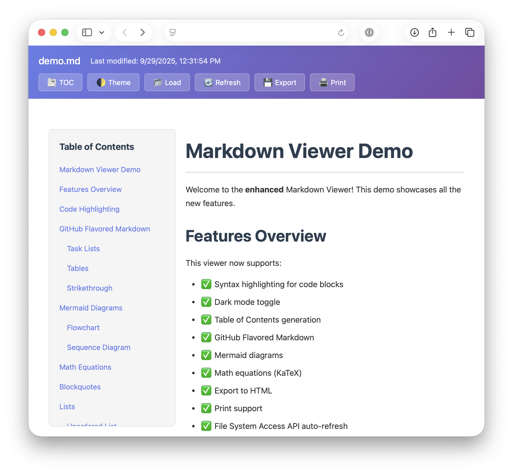

# Markdown Viewer

A lightweight, single-file markdown viewer for fast and easy document review.

## Features

- **Zero Configuration** - Just open the HTML file in any browser
- **Drag & Drop** - Load markdown files instantly
- **Auto-Refresh** - Automatically reload when files change (Chrome/Edge only)
- **Syntax Highlighting** - 180+ languages supported via highlight.js
- **Dark Mode** - Toggle between light and dark themes
- **Table of Contents** - Auto-generated navigation for long documents
- **GitHub Flavored Markdown** - Tables, task lists, and strikethrough
- **Mermaid Diagrams** - Flowcharts, sequence diagrams, and more
- **Math Equations** - KaTeX rendering for LaTeX expressions
- **Export & Print** - Save as HTML or print with optimized layouts

## Usage

### Web Browser Version

1. Open `markdown-viewer.html` in your browser
2. Load a markdown file using one of two methods:
   - **Drag and drop** - Quick loading, but no auto-refresh
   - **Click "Load File" button** - Enables auto-refresh in Chrome/Edge
3. Use the toolbar buttons to navigate and interact with your document

**Auto-Refresh Feature:** When you load a file using the "Load File" button in **Chrome** or **Edge**, the viewer will automatically detect changes to the file and refresh the display every 2 seconds. This is perfect for editing markdown in your favorite editor while previewing changes in real-time.

**Note:** Auto-refresh requires the File System Access API, which is only available in Chrome, Edge, and Opera. Safari and Firefox users can still use the viewer with drag-and-drop or the Load button, but will need to manually click the "Refresh" button to see updates.

### BBEdit Preview Template

Use the enhanced viewer as a BBEdit preview template with **true auto-refresh** in all browsers:

**Installation:**
1. In Finder, press `⇧⌘G` and paste: `~/Library/Application Support/BBEdit/Preview Templates/`
2. Copy `bbedit-preview-template.html` to this folder
3. In BBEdit, open any `.md` file and press `⌃⌘P`
4. Select `bbedit-preview-template.html` from the Templates menu

**Benefits:**
- ✅ **True auto-refresh** - Updates instantly when you save (no 2-second polling)
- ✅ **Works in all browsers** - No File System Access API needed
- ✅ **Seamless workflow** - Edit and preview in one app
- ✅ **All features included** - Syntax highlighting, Mermaid, KaTeX, TOC, dark mode

**Note:** BBEdit version available in the `bbedit-template` branch.

## Requirements

Modern web browser with JavaScript enabled. No installation or build process required.

## Demo

Load `demo/demo.md` to see all features in action.

## License

MIT License - see [LICENSE](LICENSE) file for details.