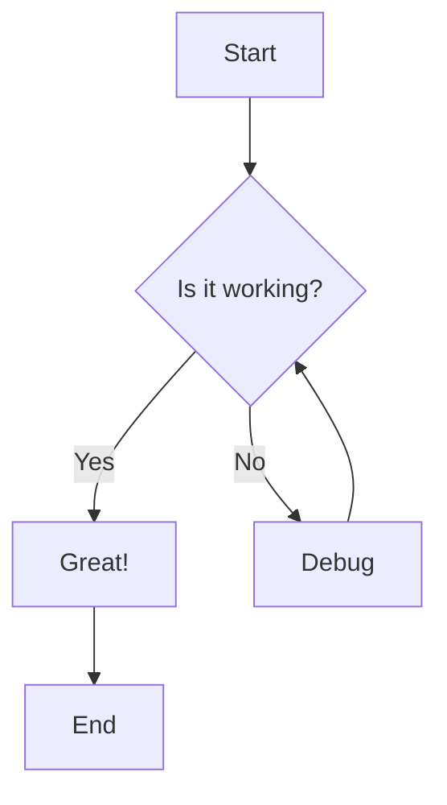
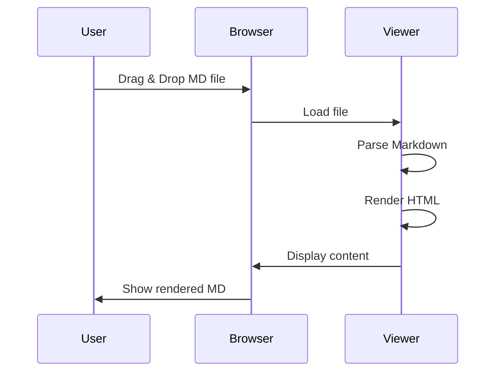

# Markdown Viewer Demo

Welcome to the **enhanced** Markdown Viewer! This demo showcases all the new features.

## Features Overview

This viewer now supports:

- ✅ Syntax highlighting for code blocks
- ✅ Dark mode toggle
- ✅ Table of Contents generation
- ✅ GitHub Flavored Markdown
- ✅ Mermaid diagrams
- ✅ Math equations (KaTeX)
- ✅ Export to HTML
- ✅ Print support
- ✅ File System Access API auto-refresh

## Code Highlighting

Here's some JavaScript with syntax highlighting:

```javascript
function fibonacci(n) {
    if (n <= 1) return n;
    return fibonacci(n - 1) + fibonacci(n - 2);
}

console.log(fibonacci(10)); // Output: 55
```

Python example:

```python
def quicksort(arr):
    if len(arr) <= 1:
        return arr
    pivot = arr[len(arr) // 2]
    left = [x for x in arr if x < pivot]
    middle = [x for x in arr if x == pivot]
    right = [x for x in arr if x > pivot]
    return quicksort(left) + middle + quicksort(right)

print(quicksort([3, 6, 8, 10, 1, 2, 1]))
```

## GitHub Flavored Markdown

### Task Lists

- [x] Implement syntax highlighting
- [x] Add dark mode
- [x] Create TOC
- [ ] Add more themes
- [ ] Support more diagram types

### Tables

| Feature | Status | Priority |
|---------|--------|----------|
| Syntax Highlighting | ✅ Done | High |
| Dark Mode | ✅ Done | High |
| TOC | ✅ Done | Medium |
| Mermaid | ✅ Done | Medium |
| Math | ✅ Done | Low |

### Strikethrough

~~This feature was removed~~ This feature is now available!

## Mermaid Diagrams

### Flowchart



### Sequence Diagram



## Math Equations

Inline math: $E = mc^2$

Display math:

$$
\int_{-\infty}^{\infty} e^{-x^2} dx = \sqrt{\pi}
$$

The quadratic formula:

$$
x = \frac{-b \pm \sqrt{b^2 - 4ac}}{2a}
$$

Summation:

$$
\sum_{i=1}^{n} i = \frac{n(n+1)}{2}
$$

## Blockquotes

> "The best way to predict the future is to invent it."
>
> — Alan Kay

> **Note:** This is a nested quote example
> > And this is the nested content

## Lists

### Unordered List

- First item
- Second item
  - Nested item 1
  - Nested item 2
    - Deeply nested item
- Third item

### Ordered List

1. First step
2. Second step
   1. Sub-step A
   2. Sub-step B
3. Third step

## Images


## Links

Check out the [GitHub repository](https://github.com/parkertoddbrooks/simple-web-markdown-viewer) for more information.

## Horizontal Rule

---

## Conclusion

This enhanced Markdown viewer provides a rich set of features for viewing and working with Markdown files. Try out all the features using the buttons in the header!

**Happy Markdown viewing! 🎉**